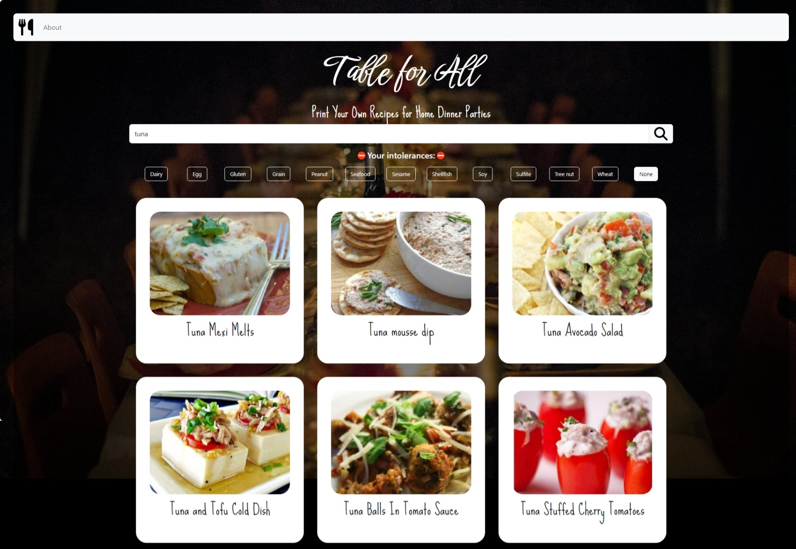
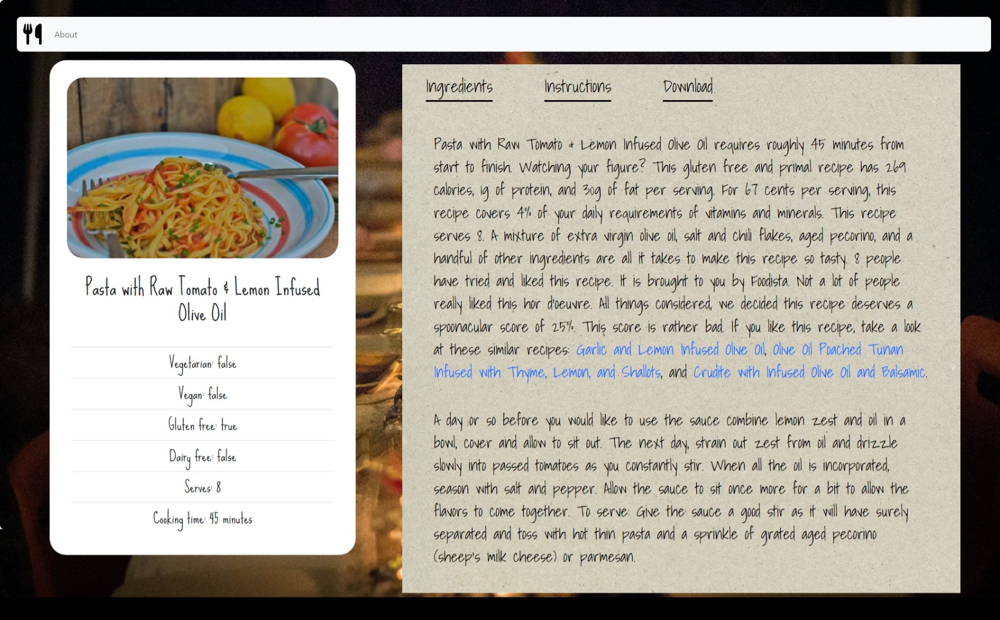
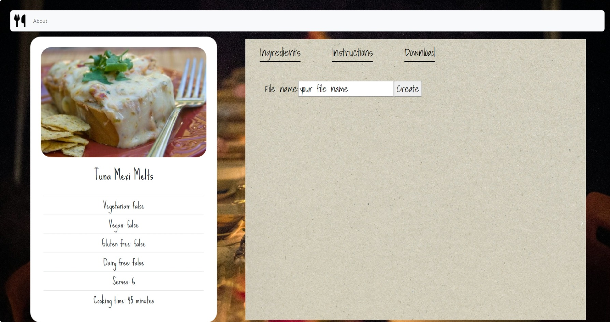

# Table for All

## Description

This application is designed for users who wish to plan for dinner parties with family and friends.

Using natural language keywords, such as cuisines, ingredients and nutrients, users can search for recipes with filters for allergens.

Step-by-step instructions, nutrition facts and accurate measurements of ingredients are presented for individual recipes. Users can also export the entire recipe to a text document file.

Link to the live application:

https://regal-cucurucho-a20175.netlify.app/

## Table of Contents

- [Installation](#installation)
- [Technologies Used](#technologies-used)
- [Features](#features)
- [Usage](#usage)

## Installation

This application has been deployed to Netlify as a client side web application. There is no need to install any application! Just follow the below usage guide.

## Technologies Used

- HTML
- JavaScript
- CSS
- Node.js
- Axios
- Spoonacular API
- Bootstrap
- React Bootstrap
- Font Awesome
- Styled-Components

## Features

- Recipe search using keywords (cuisines, ingredients, nutrients, etc.)
- Intolerances added to filter out results
- Step-by-step instructions, nutrition facts, accurate measurements of ingredients
- Recipe export as local text file

## Usage

1. To search for a recipe, type the search keyword or ingredient (or a mix of both) in the search bar, and then indicate your required dietary intolerances and press the search button.
   

2. The application will then search against Spoonacular's recipe database.
   

3. To view step-by-step instructions, nutrition facts and accurate measurements of ingredients, click on the individual recipe.
   

4. You can also download and save the recipe as a Text Document file.
   
